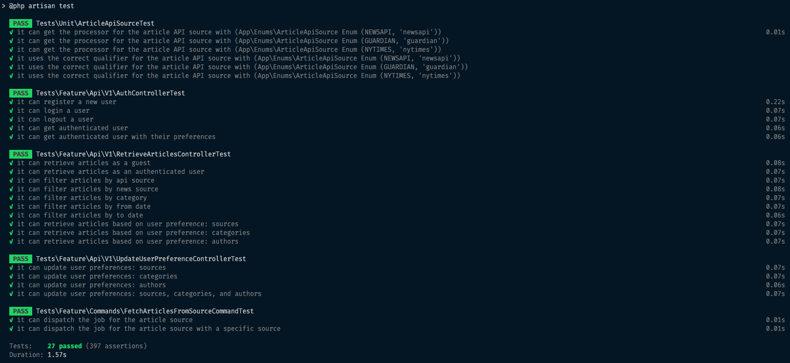

# News Aggregator API

A News Aggregation API built with Laravel 12 that fetches articles from multiple sources and provides personalized content based on user preferences.

## Features

- **Basic Authentication** - User registration, login, and logout.
- **Multi-Source Aggregation** - Fetches news from NewsAPI.org, The Guardian, and New York Times.
- **User Preferences** - Users can set preferred sources, categories, and authors
- **Advanced Filtering** - Filter articles by source, category, date range, and search keyword.
- **Versioned APIs** - Clean `/api/v1/` structure for future scalability.
- **Type Safety** - PHPStan level 10 with comprehensive type checking.
- **Consistent Responses** - Normalized API responses with success/error handling

## Configuration Notes

- `FETCH_ARTICLES_FROM_SOURCE_RECURSIVELY` - Whether to fetch articles from sources recursively (page-by-page). Default is `false` so the job can get only the first page of articles.

## Installation Guide

```bash
# Install dependencies
composer install

# Setup environment and database
composer run setup

# Run tests
composer test
```

## API Endpoints

- `POST /api/v1/auth/register` - User registration
- `POST /api/v1/auth/login` - User login
- `GET /api/v1/articles` - Browse articles (both guests & authenticated users)
- `GET /api/v1/me/` - Get current user with preferences
- `POST /api/v1/me/logout` - User logout
- `PUT /api/v1/me/preferences` - Update user preferences

**API documentation is available in the [News Aggregator API.postman_collection.json](docs/News%20Aggregator%20API.postman_collection.json) file.**

## Tech Stack

- **Laravel 12** - Modern PHP framework
- **Laravel Sanctum** - API authentication
- **PHPStan** - Static analysis
- **Laravel Pint** - Code formatting

## Data Sources

- NewsAPI.org
- The Guardian
- New York Times

Built with ❤️ using Laravel

# Screenshots

### Tests


